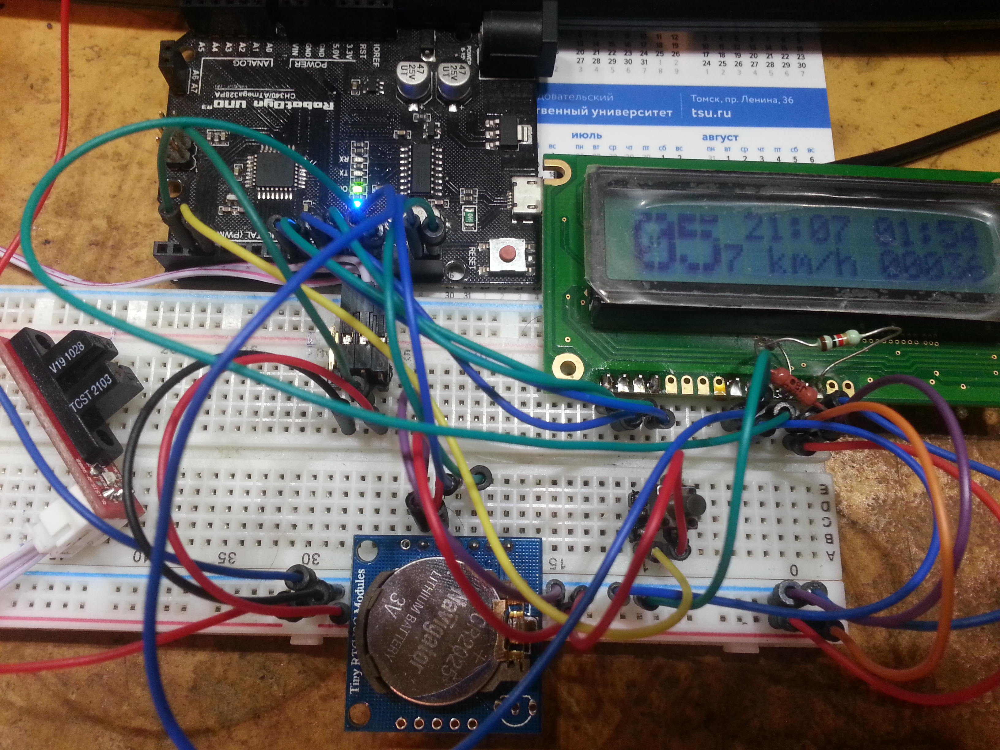

# BicycleComputer

### Feautures
* Speedometer
* Odometer
* Clock
* Timer

### Components
* Arduino UNO
* LCD 16x2 HD44780 WH1602A-YGH-CTK
* Tiny RTC I2C Modules DS1307
* Optical End-Stop Switch TCST2103