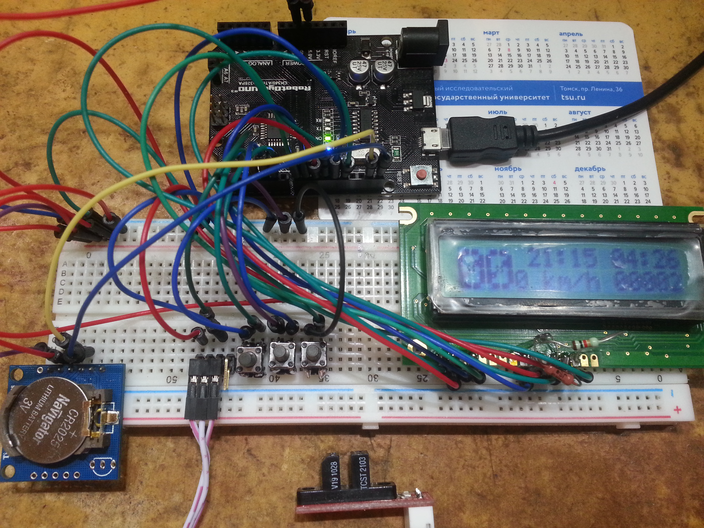

# Bicycle Computer

### Components
* Arduino UNO
* LCD 16x2 HD44780 WH1602A-YGH-CTK
* Tiny RTC I2C Modules DS1307
* Optical End-Stop Switch TCST2103

### Feautures
* Speedometer 00.0km/h
* Odometer 00000m
* Clock HH:MM
* Timer MM:SS